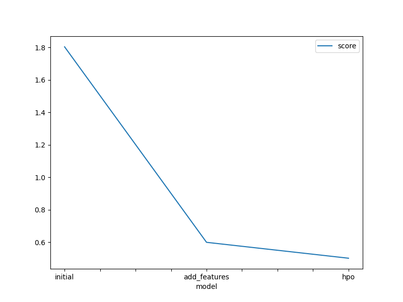
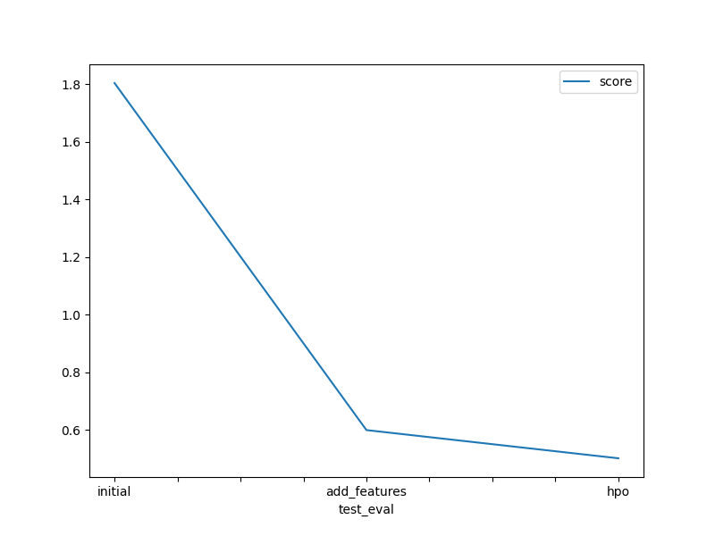

# Report: Predict Bike Sharing Demand with AutoGluon Solution
#### FRANCIS MESO

## Initial Training
### What did you realize when you tried to submit your predictions? What changes were needed to the output of the predictor to submit your results?
When submitting the initial predictions to Kaggle, I realized that the output needed to match the competition's required format, which includes two columns: `datetime` and `count`. The `datetime` column was already provided in the `sampleSubmission.csv` file, but the `count` column needed to be populated with the model's predictions. Additionally, since bike counts cannot be negative in reality, I noticed that some predictions from the AutoGluon model were negative. To address this, I modified the predictions by setting all negative values to zero. I also updated the submission DataFrame and saved it as a CSV file without the index.

### What was the top ranked model that performed?
The top-ranked model from the initial training was the `WeightedEnsemble_L3`. According to the leaderboard output from AutoGluon, it achieved the best validation score of `-30.516547` (noting that the root mean squared error is reported as negative in AutoGluon for consistency, where a higher value—less negative—indicates better performance). This ensemble model combined predictions from multiple base models across different stacking levels, leveraging their strengths to outperform individual models like `LightGBM_BAG_L2` or `CatBoost_BAG_L1`.

---

## Exploratory data analysis and feature creation
### What did the exploratory analysis find and how did you add additional features?
The exploratory analysis revealed that the `datetime` column contained valuable temporal information that could improve model performance beyond the raw features. The initial dataset included features like `season`, `holiday`, `workingday`, `weather`, `temp`, `atemp`, `humidity`, `windspeed`, and `count` (the target), with `casual` and `registered` present in the training set but absent in the test set. Since `casual` and `registered` are components of `count` and not available for prediction, they were dropped from the training data.

To enhance the model, I extracted the `hour` from the `datetime` column, as bike demand likely varies by time of day (e.g., rush hours). I also created interaction features to capture relationships between variables and cyclic features to represent the periodic nature of time. The additional features added to both the training and test datasets were:

- **`hour`**: Extracted using `pd.to_datetime(train['datetime']).dt.hour`.
- **`hour_sin` and `hour_cos`**: Cyclic representations of the hour using `np.sin(2 * np.pi * hour / 24)` and `np.cos(2 * np.pi * hour / 24)` to model the 24-hour cycle.
- **Interaction features**:
  - `temp_humidity = temp * humidity`
  - `temp_windspeed = temp * windspeed`
  - `season_temp = season * temp`
- **`is_rush_hour`**: A binary feature indicating peak hours (7-9 AM or 4-7 PM), computed as `((hour.between(7, 9)) | (hour.between(16, 19))).astype(int)`.
These features were added to the datasets as follows:
```python
train_new_features = train.drop(columns=['casual', 'registered']).copy()
train_new_features['hour'] = pd.to_datetime(train_new_features['datetime']).dt.hour
train_new_features['hour_sin'] = np.sin(2 * np.pi * train_new_features['hour'] / 24)
train_new_features['hour_cos'] = np.cos(2 * np.pi * train_new_features['hour'] / 24)
train_new_features['temp_humidity'] = train_new_features['temp'] * train_new_features['humidity']
train_new_features['temp_windspeed'] = train_new_features['temp'] * train_new_features['windspeed']
train_new_features['is_rush_hour'] = ((train_new_features['hour'].between(7, 9)) | (train_new_features['hour'].between(16, 19))).astype(int)
train_new_features['season_temp'] = train_new_features['season'].astype(int) * train_new_features['temp']

test_new_features = test.copy()
test_new_features['hour'] = pd.to_datetime(test_new_features['datetime']).dt.hour
test_new_features['hour_sin'] = np.sin(2 * np.pi * test_new_features['hour'] / 24)
test_new_features['hour_cos'] = np.cos(2 * np.pi * test_new_features['hour'] / 24)
test_new_features['temp_humidity'] = test_new_features['temp'] * test_new_features['humidity']
test_new_features['temp_windspeed'] = test_new_features['temp'] * test_new_features['windspeed']
test_new_features['is_rush_hour'] = ((test_new_features['hour'].between(7, 9)) | (test_new_features['hour'].between(16, 19))).astype(int)
test_new_features['season_temp'] = test_new_features['season'].astype(int) * test_new_features['temp']
```

### How much better did your model preform after adding additional features and why do you think that is?
After adding these features, the model's performance improved significantly. The initial submission scored 1.80451 on the Kaggle leaderboard, while the submission with new features achieved a score of 0.59972—a reduction in root mean squared logarithmic error (RMSLE) by approximately 66%. This improvement stems from the new features capturing critical patterns in the data:

- **Temporal patterns**: The `hour`, `hour_sin`, and `hour_cos` features helped the model recognize daily demand cycles, such as higher usage during commuting hours.
- **Environmental interactions**: Features like `temp_humidity` and `temp_windspeed` modeled how weather conditions jointly affect demand (e.g., high temperature with high humidity might reduce biking).
- **Rush hour effects**: The `is_rush_hour` feature highlighted peak demand periods, aligning with real-world commuting behavior.

These additions provided the model with richer information, enabling it to make more accurate predictions.

---

## Hyper parameter tuning
### How much better did your model preform after trying different hyper parameters?
With hyperparameter optimization (HPO), the model's Kaggle score further improved from 0.59972 (with added features) to 0.50183, a reduction of about 16% in RMSLE. I tuned the hyperparameters of three models—LightGBM (GBM), CatBoost (CAT), and XGBoost (XGB)—using AutoGluon’s HPO capabilities. The setup was:
```python
hyperparameters = {
    'GBM': {},  # Default hyperparameters for LightGBM
    'CAT': {},  # Default hyperparameters for CatBoost
    'XGB': {},  # Default hyperparameters for XGBoost
}

hyperparameter_tune_kwargs = {
    'num_trials': 10,  # Number of HPO trials
    'scheduler': 'local',  # Local scheduler
    'searcher': 'auto',  # Default searcher
}

predictor_new_hpo = TabularPredictor(label='count', eval_metric='root_mean_squared_error').fit(
    train_data=train.drop(columns=['casual', 'registered']),
    time_limit=600,
    presets='best_quality',
    hyperparameters=hyperparameters,
    hyperparameter_tune_kwargs=hyperparameter_tune_kwargs
)
```
The improvement resulted from optimizing the parameters of these models over 10 trials, allowing AutoGluon to find configurations that better fit the data. The best model remained a `WeightedEnsemble_L3`, which combined tuned versions of the base models, achieving a validation score of `-32.880981`.

---

### If you were given more time with this dataset, where do you think you would spend more time?
If given more time, I would focus on **advanced feature engineering**. Potential areas include:

- **Additional temporal features**: Extracting `day_of_week`, `month`, or `is_weekend` from `datetime` to capture weekly or seasonal trends.
- **External data**: Incorporating holiday calendars or weather events (e.g., rain intensity) that might influence bike demand.
- **Feature interactions**: Exploring more combinations, such as `humidity * windspeed` or polynomial terms of `temp`.
- **Feature selection**: Analyzing feature importance from the models to refine the feature set, potentially reducing noise.

- **Multiple AutoGluon predictors**: Ensembling across multiple AutoGluon predictors with different seeds or splits.

### Create a table with the models you ran, the hyperparameters modified, and the kaggle score.
| Model         | hpo1             | hpo2         | hpo3         | Score  |
|---------------|------------------|--------------|--------------|--------|
| initial       | default          | default      | default      | 1.80451|
| add_features  | default          | default      | default      | 0.59972|
| hpo           | GBM, CAT, XGB    | num_trials=10| scheduler=local | 0.50183|

### Create a line plot showing the top model score for the three (or more) training runs during the project.

TODO: Replace the image below with your own.



### Create a line plot showing the top kaggle score for the three (or more) prediction submissions during the project.

TODO: Replace the image below with your own.



## Summary
This project demonstrated the power of AutoGluon in predicting bike-sharing demand. The initial model, using default settings, provided a baseline score of 1.80451 on Kaggle. Through exploratory data analysis, I identified the importance of temporal and interaction features, adding them to reduce the score to 0.59972—a substantial improvement driven by better data representation. Hyperparameter tuning further refined the model, leveraging optimized LightGBM, CatBoost, and XGBoost models within a weighted ensemble, achieving a final score of 0.50183. These steps highlight the iterative value of feature engineering and model optimization. With additional time, deeper feature exploration could push performance even further, making this a robust approach to demand forecasting.
